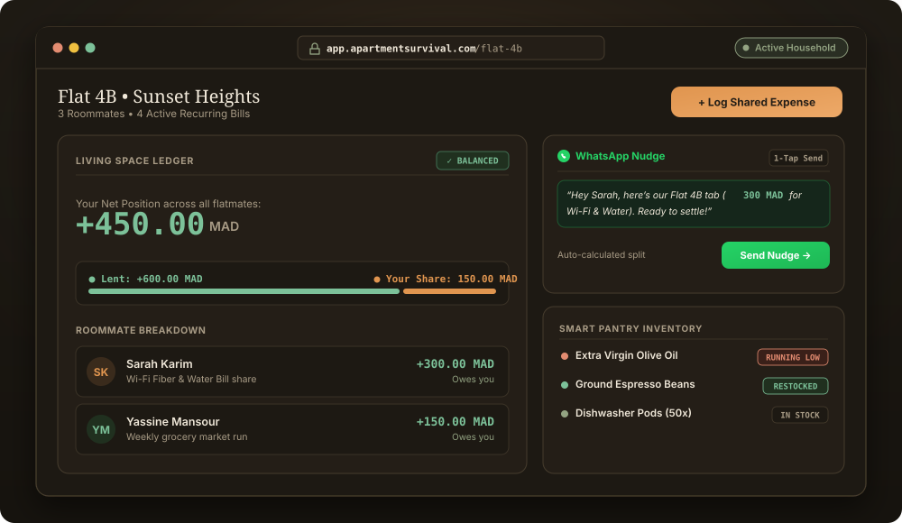
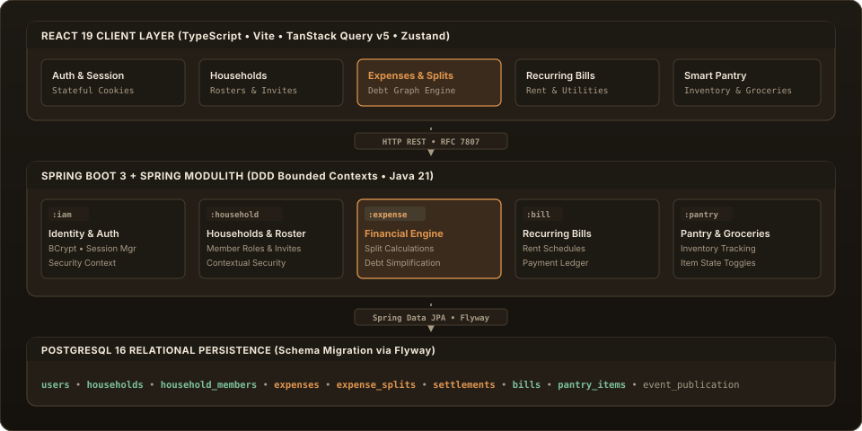
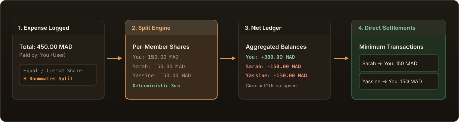

<div align="center">

# 🏠 Apartment Survival

**Full-Stack Modular Household Ledger & Management Platform**

<p>
  <i>"No more chasing roommates for Wi-Fi money."</i>
</p>

[](https://openjdk.org/)
[](https://spring.io/projects/spring-boot)
[](https://spring.io/projects/spring-modulith)
[](https://www.postgresql.org/)
[](https://react.dev/)
[](https://www.typescriptlang.org/)
[](https://tanstack.com/query)
[](https://zustand.docs.pmnd.rs/)

<p align="center">
  <b>✓ Zero setup required</b> &nbsp;•&nbsp;
  <b>✓ Instant WhatsApp settlements</b> &nbsp;•&nbsp;
  <b>✓ Deterministic debt graph engine</b> &nbsp;•&nbsp;
  <b>✓ Connected pantry inventory</b>
</p>

</div>

---

### 🖥️ Live Product Vignette

<p align="center">
  
</p>

---

## 📐 Architecture Overview

<p align="center">
  
</p>

---

## 💡 Why I Built This

Living with roommates creates a surprising amount of shared state:
- Who paid for rent and utilities?
- Who owes whom, and how can cascading debts be simplified?
- What groceries or household supplies are low?
- How can an expense with uneven shares be split fairly?

**Apartment Survival** centralizes these workflows into a single platform while enforcing clean architectural boundaries, explicit authorization rules, and a deterministic financial calculation engine.

---

## ⭐ Engineering Highlights

- **Domain-Driven Modular Monolith**: Built with Spring Modulith to enforce business module isolation (`iam`, `household`, `expense`, `bill`, `pantry`) without distributed system overhead.
- **Financial Calculation & Debt Simplification Engine**: Dedicated domain engines isolate financial calculations (even/uneven splitting, net balances, debt simplification, settlements) from HTTP controllers and database logic.
- **Household-Scoped Authorization (IDOR/BOLA Protection)**: Contextual method-level security (`@PreAuthorize("@householdSecurity.isHouseholdMember(#householdId)")`) ensures zero cross-household data leakage.
- **Stateful Session Security**: HttpOnly session cookies, BCrypt password hashing, session fixation mitigation, and strict CSRF protection.
- **Event-Driven Module Communication**: Decoupled interactions via Spring Modulith domain events and persistent outbox/event publications.
- **Feature-Driven Frontend Architecture**: React 19 + TypeScript organized by feature modules with TanStack Query v5 managing server cache and Zustand holding client UI state.

---

## 💸 Financial Domain Engine

Financial calculations are treated as isolated domain logic rather than raw database manipulations:

<p align="center">
  
</p>

### Supported Operations
- **Expense Splitting**: Equal splits, custom fixed amounts, and percentage allocations.
- **Net Balance Computation**: Aggregates debits and credits across all expenses and settlements within a household.
- **Debt Simplification**: Reduces circular multi-party debts into the minimum number of direct transactions.
- **Settlement Tracking**: Records payments between roommates to reconcile outstanding balances.

---

## 🧩 Backend Modules

| Module | Responsibility | Public Interface |
| :--- | :--- | :--- |
| `iam` | User identity, registration, BCrypt credential verification, session lifecycle | IAM Services & DTOs |
| `household` | Household creation, membership management, invitation code handling | Household APIs & Domain Events |
| `expense` | Expenses, custom splits, balance calculations, settlements, debt graph simplification | Expense APIs & Balance Services |
| `bill` | Recurring utility and rent tracking, payment records, schedule forecasting | Bill APIs |
| `pantry` | Household inventory, supplies, and dynamic grocery checklists | Pantry APIs |

---

## 🔐 Security Architecture

- **Authentication**: Stateful sessions via `JSESSIONID` with `HttpOnly`, `SameSite=Lax`, and `Secure` attributes.
- **Session Protection**: Automatic session fixation protection upon login and concurrent session constraints.
- **Authorization Boundaries**: Role- and membership-based method security evaluated per household.
- **CSRF Defense**: Cookie-backed CSRF tokens with automatic header synchronization for state-mutating requests.
- **Data Protection**: Zero raw credentials stored; passwords hashed using BCrypt with configurable work factor.

---

## 🛠️ Tech Stack

### Backend
- **Language**: Java 21
- **Framework**: Spring Boot 3.x, Spring Modulith
- **Security**: Spring Security 6.x
- **Persistence**: Spring Data JPA, Hibernate, HikariCP
- **Database**: PostgreSQL
- **Migrations**: Flyway

### Frontend
- **Framework**: React 19, TypeScript, Vite
- **Server State**: TanStack React Query v5
- **Client State**: Zustand
- **Networking**: Axios (with centralized `ProblemDetail` error handling)
- **Styling**: Tailwind CSS & Semantic CSS Variables

---

## 📁 Repository Structure

```text
apartment-survival/
│
├── Java-backend/
│   ├── src/
│   │   ├── main/
│   │   │   ├── java/com/apartment/survival/
│   │   │   │   ├── iam/
│   │   │   │   ├── household/
│   │   │   │   ├── expense/
│   │   │   │   ├── bill/
│   │   │   │   ├── pantry/
│   │   │   │   └── common/
│   │   │   └── resources/
│   │   │       ├── db/migration/
│   │   │       └── application.yml
│   │   └── test/
│   └── pom.xml
│
├── frontend/
│   ├── src/
│   │   ├── features/
│   │   │   ├── auth/
│   │   │   ├── households/
│   │   │   ├── expenses/
│   │   │   ├── bills/
│   │   │   └── pantry/
│   │   ├── domain/
│   │   ├── services/
│   │   └── components/
│   ├── package.json
│   └── vite.config.ts
│
├── docs/
│   └── API_CONTRACTS.md
└── README.md
```

---

## 📡 API Contract Reference

The backend exposes a standardized REST interface under `/api`. Endpoints return RFC 7807 `ProblemDetail` payloads on validation or business errors.

| Area | Base Path | Core Endpoints |
| :--- | :--- | :--- |
| **Auth** | `/api/auth` | `POST /login`, `POST /register`, `POST /logout`, `GET /me` |
| **Households** | `/api/households` | `GET /`, `POST /`, `GET /{id}`, `POST /{id}/invites` |
| **Expenses** | `/api/expenses` | `GET /?householdId={id}`, `POST /`, `GET /balances?householdId={id}` |
| **Bills** | `/api/bills` | `GET /?householdId={id}`, `POST /`, `POST /{id}/payments` |
| **Pantry** | `/api/pantry` | `GET /?householdId={id}`, `POST /`, `PATCH /{id}/toggle` |

> For comprehensive request/response schemas, DTOs, and sync states, see [docs/API_CONTRACTS.md](docs/API_CONTRACTS.md).

---

## 🚀 Getting Started

### Prerequisites
- **Java 21+**
- **Node.js 20+** & **npm**
- **PostgreSQL 15+**

### 1. Database Setup
Create the PostgreSQL database:
```sql
CREATE DATABASE apartment_survival;
```

Configure connection parameters in `Java-backend/src/main/resources/application.yml`:
```yaml
spring:
  datasource:
    url: jdbc:postgresql://localhost:5432/apartment_survival
    username: postgres
    password: your_password
```

### 2. Run Backend
```bash
cd Java-backend
./mvnw spring-boot:run
```
*(On Windows: `mvnw.cmd spring-boot:run`)*

Flyway automatically applies schema migrations located in `db/migration/`.

### 3. Run Frontend
```bash
cd frontend
npm install
npm run dev
```

The application will be accessible at `http://localhost:5173`.

---

## 🧪 Testing

Execute backend unit and integration tests:
```bash
cd Java-backend
./mvnw test
```

Execute frontend unit tests:
```bash
cd frontend
npm test
```

---

## 📄 License

This project is licensed under the MIT License.
